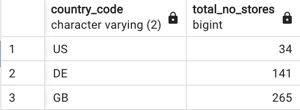
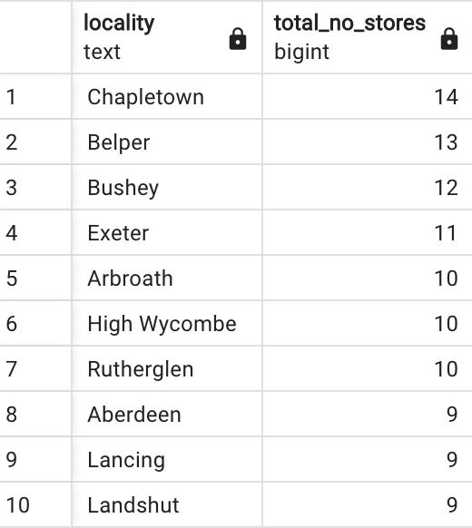
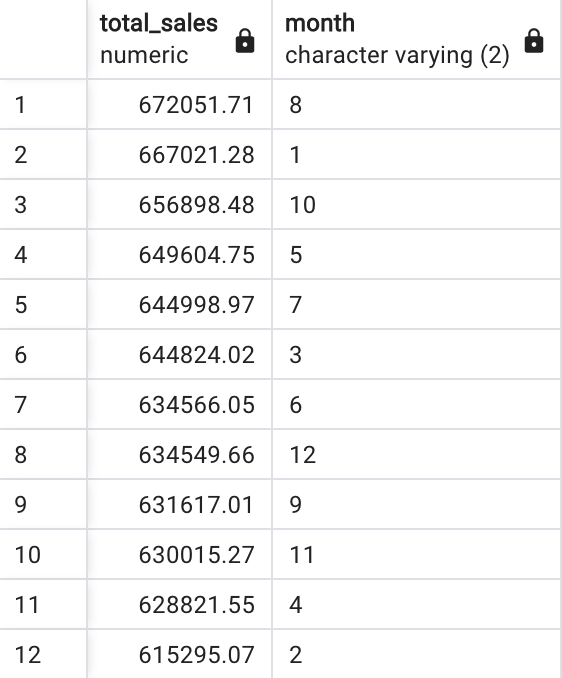
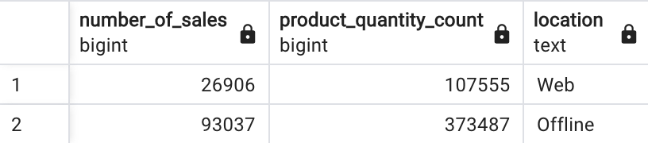
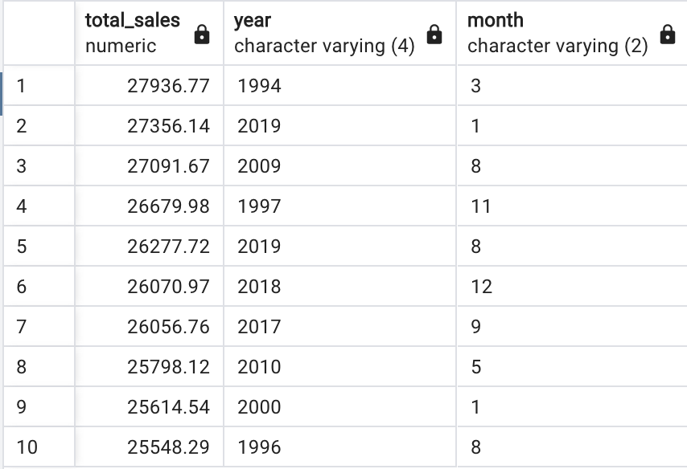
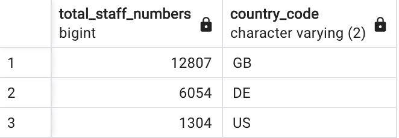
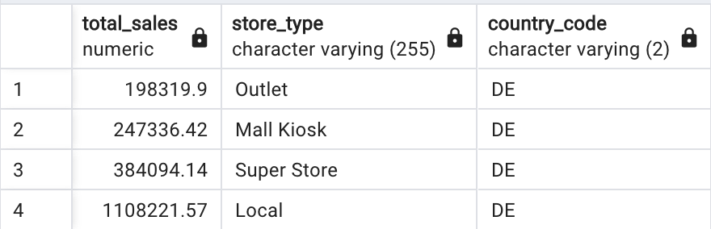
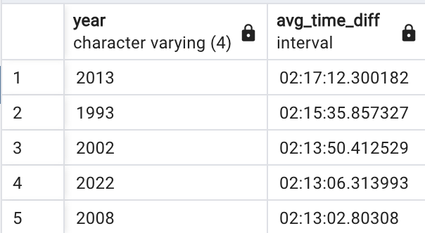

# Create relational database for multi-national sales data
## Max Thomas
Data are extracted, cleaned, then stored in a relational database. The data are sales data for a company with 450 stores in the UK, Germany, and the US. 

Insights are extracted from the new database using several SQL queries, shown below.

## Insights from database

### Query 1
First we get a breakdown of the companie's stores in each country. The where clause removes the single web based store.
```
SELECT country_code, count(country_code) AS total_no_stores
FROM dim_store_details
WHERE NOT locality = 'N/A'
GROUP BY country_code
ORDER BY total_no_stores;
```


### Query 2
Next, we get a breakdown of the number of stores in different locations.
```
SELECT locality, count(locality) AS total_no_stores
FROM dim_store_details
GROUP BY locality
ORDER BY total_no_stores DESC, locality
LIMIT 10;
```


### Query 3
Here, we get the total sales (GBP) in each month of the year.
```
SELECT ROUND(CAST(SUM(orders_table.product_quantity * dim_products.price_gbp) AS NUMERIC), 2) AS total_sales,
	   dim_date_times.month
FROM orders_table
JOIN 
	dim_products ON dim_products.product_code = orders_table.product_code
JOIN 
	dim_date_times ON dim_date_times.date_uuid = orders_table.date_uuid
GROUP BY
	dim_date_times.month
ORDER BY total_sales DESC, month
```


### Query 4
The total sales are found for online and in person sales.
```
SELECT COUNT(orders_table.date_uuid) AS number_of_sales,
	   SUM(orders_table.product_quantity) AS product_quantity_count,
	   CASE 
	        WHEN dim_store_details.store_type = 'Web Portal' THEN 'Web'
		    ELSE 'Offline' 
	   END AS location
FROM orders_table
JOIN
	dim_store_details ON dim_store_details.store_code = orders_table.store_code
GROUP BY location
ORDER BY location DESC

```


### Query 5
For in person sales, we breakdown the sales per store type.
```
SELECT store_type, ROUND(CAST(total_sales AS NUMERIC),2) AS total_sales, ROUND(CAST(pct_total AS NUMERIC)) AS pct_total
FROM
(SELECT store_type,
	   SUM(orders_table.product_quantity * dim_products.price_gbp) AS total_sales,
	   100 * SUM(orders_table.product_quantity * dim_products.price_gbp) / 
	   (SELECT SUM(orders_table.product_quantity * dim_products.price_gbp)
		FROM orders_table
		JOIN
			dim_products ON orders_table.product_code = dim_products.product_code) AS pct_total
FROM orders_table
JOIN
	dim_store_details ON dim_store_details.store_code = orders_table.store_code	  
JOIN 
	dim_products ON orders_table.product_code = dim_products.product_code
GROUP BY store_type
ORDER BY total_sales DESC) as otf
```


### Query 6
We find the highest sales in each month of each year, and return them here.
```
SELECT ROUND(CAST(SUM(orders_table.product_quantity * dim_products.price_gbp) AS NUMERIC),2) AS total_sales,
	   year, month
FROM orders_table
JOIN
	dim_date_times ON dim_date_times.date_uuid = orders_table.date_uuid	  
JOIN 
	dim_products ON orders_table.product_code = dim_products.product_code
GROUP BY year, month
ORDER BY total_sales DESC
LIMIT 10
```


### Query 7
First we get a breakdown of the companie's stores in each country. The where clause removes the single web based store.
```
SELECT country_code, count(country_code) AS total_no_stores
FROM dim_store_details
WHERE NOT locality = 'N/A'
GROUP BY country_code
ORDER BY total_no_stores;
```


### Query 8
We get the staff count in each country.
```
SELECT SUM(staff_numbers) AS total_staff_numbers, country_code
FROM dim_store_details
WHERE NOT address = 'N/A'
GROUP BY country_code
ORDER BY total_staff_numbers DESC;
```


### Query 9
finally, we get the average time between sales for each year.
```
SELECT year, AVG(time_diff) AS avg_time_diff FROM
(SELECT sales_timestamp - LAG(sales_timestamp) OVER (ORDER BY sales_timestamp) AS time_diff,
	   year
FROM
(SELECT TO_TIMESTAMP(year || ' ' || LPAD(month, 2, '0') || ' ' || LPAD(day, 2, '0') || ' ' || timestamp, 
				   'YYYYMMDDHH24:MI:ss') AT TIME ZONE 'UTC' AS sales_timestamp,
	   year
FROM dim_date_times
ORDER BY sales_timestamp) AS otf1) AS otf2
GROUP BY year
ORDER BY avg_time_diff DESC
LIMIT 5

```



### Replicate the results
To replicate the extraction, cleaning, and storing steps, first install a relational database package. Create a file at *setup/local_credentials.yaml* with the reuired information to access the local database:
```
host: localhost
password: xxxxx
username: postgres
database: sales_data
drivername: postgresql
port: 5432
```
The execute:
```
./code/run
```
The local database will be populated with the following tables:
- dim_users
- dim_products
- dim_store_details
- dim_date_times
- dim_card_details
- orders_table